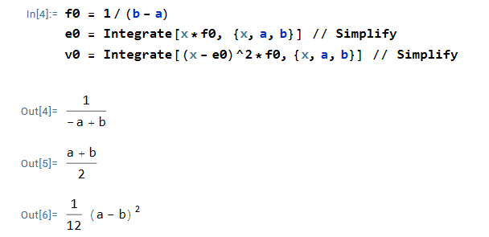
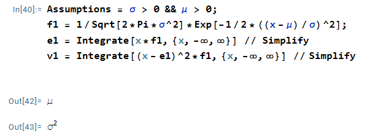
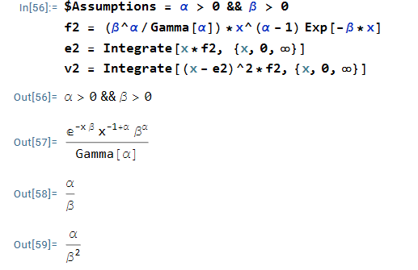
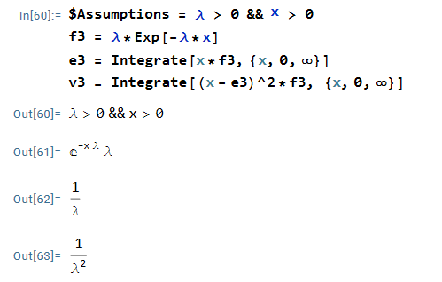

```{r setup, include=FALSE}
knitr::opts_chunk$set(echo = TRUE)
```

### Overview

The objective of Task 2 is to determine the Expected Value (EV) and Variance of stochastic variables and fit appropriate models. The analysis involves functions $f_0$, $f_1$, $f_2$, and $f_3$.

### Finding Expected Value and Variance

#### **$f_0$**


For $f_0$, the expected value is given by the formula 
$EV = \frac{a+b}{2}$

Similarly, the variance is expressed as:

$Var = \frac{(a-b)^2}{12}$

---

#### **$f_1$**


For $f_1$, the expected value is given by the formula 
$EV = μ$

Similarly, the variance is expressed as:

$Var = σ^2$

---

#### **$f_2$**


For $f_2$, the expected value is given by the formula 
$EV = \frac{α}{β}$

Similarly, the variance is expressed as:

$Var = \frac{α}{β^2}$

---

#### **$f_3$**


For $f_0$, the expected value is given by the formula 
$EV = \frac{1}{λ}$

Similarly, the variance is expressed as:

$Var = \frac{1}{λ^2}$

---

### Find a & b for $f_0$

The Expected Value (EV) and Variance for $f_0$ are obtained from Wolfram Mathematica, leading to the following equations:

$EV = 2.79164 = \frac{a+b}{2}$

$Var = 10.97915 = \frac{(a-b)^2}{12}$

Solving these equations, we find the values for a and b as follows:

$a=\frac{\sqrt{12Var}-2EV}{-2}$

$b=2EV-a$

```{r}
EV <- 2.79164
V <- 10.97915

# Calculate 'a' and 'b'
a <- (sqrt(12 * V) - 2 * EV) / -2
b <- 2 * EV - a

# Display results
a
b
b - a

```
### Fitted Distribution for $f_0$

```{r}
# Define function for f0
f0 <- function(x,a,b){0*x+1/(b-a)}

# Plot histogram
library(data4soils)
Ng <- cfbp_fpjuliet$ng
hist(Ng, probability = TRUE, main = "Fitted distribution", breaks = 100, col = "lightblue", xlab = "X-axis Label", ylab = "Y-axis Label")

# Plot fitted line
x <- seq(0, 20, 2)
lines(x, f0(x, a, b), col = "red", lwd = 2)
```

According to the code, a = -2.947476 and b = 8.530756.
The best fitted model for $f_0$ is given by
 
$f_0(x;a,b) = \frac{1}{b-a} = \frac{1}{11.47823}$

However, the model appears suboptimal as the line is flat and does not align with the plot.

### Find $\lambda$ for $f_3$

```{r}
lambda <- 1 / EV
lambda
```
The parameter $f_3$ is determined using the relationship
EV = 2.79164 = $\frac1λ$
λ = $\frac1{EV}$


### Fitted Exponential Distribution for $f_3$
```{r}
# Define function for f3
f3 <- function(x, l) {
  l * exp(l * (-x))
}

# Plot histogram
hist(Ng, probability = TRUE, main = "Fitted exponential distribution", breaks = 100, col = "lightgreen", xlab = "X-axis Label", ylab = "Y-axis Label")

# Plot fitted line
l <- 0.358
x <- seq(0, 100, 2)
lines(x, f3(x, l), col = "darkgreen", lwd = 2)
```

According to the code, λ = 0.358

The best-fitted model for $f_3$ is given by:

$f_3(x;λ) = λe^{−λx} = 0.358e^{−0.358x}$

### Conclusion
While the fitted model for $f_0$ appears less than ideal, the model for $f_3$ demonstrates a reasonable fit. Further refinements may be needed for $f_0$ to align the model more closely with the data. The analysis provides valuable insights into the characteristics of these stochastic variables, laying the foundation for future improvements and applications.