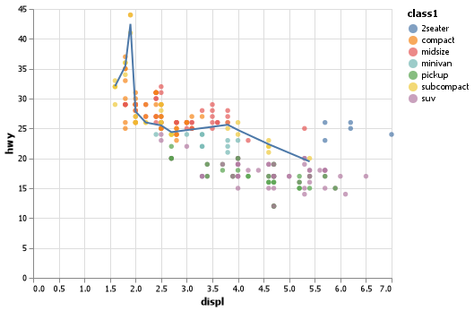

# Client Report - [Introduction]
__Course DS 250__
__Joshua Ludwig__

## Elevator pitch

_This is code used to anaysis the data of from "mpg.csv". This shows the miles per gallon used from each class of car and on which highway it was recorded on._

##### TECHNICAL DETAILS

```python 
base = (alt.Chart(mpg.rename(columns = {"class": "class1"}))
  .encode(
    x = "displ",
    y = "hwy"
    ))

chart_smooth_sub = (base
  .transform_filter(alt.datum.class1 == "subcompact")
  .transform_loess("displ", "hwy")
  .mark_line()
)  

chart = base.encode(color = "class1").mark_circle() + chart_smooth_sub

chart.save("altair_combine_clean_color_filter.png")
```



```python 
mpg =pd.read_csv("mpg.csv")
print(mpg
    .head(5)
    .filter(["manufacturer", "model","year", "hwy"])
    .to_markdown(index=False))
```
| manufacturer   | model   |   year |   hwy |
|:---------------|:--------|-------:|------:|
| audi           | a4      |   1999 |    29 |
| audi           | a4      |   1999 |    29 |
| audi           | a4      |   2008 |    31 |
| audi           | a4      |   2008 |    30 |
| audi           | a4      |   1999 |    26 |

## APPENDIX A (PYTHON CODE)
```python
#%% Loading in libraires
import pandas as pd
import altair as alt

# %%Loading in data

mpg =pd.read_csv("mpg.csv")
print(mpg
    .head(5)
    .filter(["manufacturer", "model","year", "hwy"])
    .to_markdown(index=False))


# %%
chartleft = (alt.Chart(mpg)
  .encode(
    x = "displ",
    y = "hwy",
    )
  .transform_loess("displ", "hwy")
  .mark_line())


#%%
chartmiddle = (alt.Chart(mpg)
  .encode(
    x = "displ",
    y = "hwy",
    detail = "drv"
    )
  .transform_loess("displ", "hwy", groupby = ["drv"])
  .mark_line())

print(chartmiddle)


#%%
chartright = (alt.Chart(mpg)
  .encode(
    x = "displ",
    y = "hwy",
    color=alt.Color("drv", legend=None)
    )
  .transform_loess("displ", "hwy", groupby = ["drv"])
  .mark_line())
#%%
chartleft.save("altair_chartleft.png")
chartmiddle.save("altair_chartmiddle.png")
chartright.save("altair_chartright.png")

# %%
chartp = (alt.Chart(mpg)
  .encode(
    x = "displ",
    y = "hwy"
  )
  .mark_circle()
)

chart = chartp + chartleft  

chart.save("altair_chartcombine.png")
  

# %%
base =(alt.Chart(mpg)
  .encode(
    x = "displ",
    y = "hwy"
  ))

chart = base.encode(color = "drv").mark_circle() + base.transform_loess("displ", "hwy").mark_line()

chart.save("altair_combine_clean_color.png")
# %%

#column name of class does not work nicely with Altair filter.

base = (alt.Chart(mpg.rename(columns = {"class": "class1"}))
  .encode(
    x = "displ",
    y = "hwy"
    ))

chart_smooth_sub = (base
  .transform_filter(alt.datum.class1 == "subcompact")
  .transform_loess("displ", "hwy")
  .mark_line()
)  

chart = base.encode(color = "class1").mark_circle() + chart_smooth_sub

chart.save("altair_combine_clean_color_filter.png")
# %%
```
