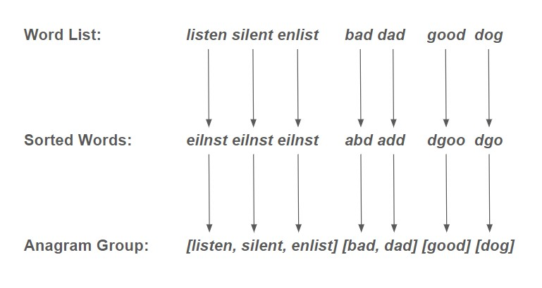

# Set
A set is an unordered collection of unique elements. It is a built-in data type that provides a useful way to work with collections of distinct items. Sets are defined by enclosing comma-separated values within curly braces {} or by using the set() function.

Here are some things that can be done because of set:
1. Removing duplicates from a collection
2. Checking for membership
3. Performing set operations
4. Finding distinct elements
5. Implementing mathematical concepts

## Set operations
These operations form the basic interface for working with sets.

* `|`: Returns a new set that contains all the unique elements from both sets.
* `&`: Returns a new set that contains the common elements between two sets.
* `-`: Returns a new set that contains the elements present in the first set but not in the second set.
* `^`: Returns a new set that contains the elements that are present in either of the sets, but not in both.
* `<=`: Checks if all the elements of one set are present in another set.
* `>=`: Checks if all the elements of one set are present in another set.

Here are some examples of set operations:

```python
set1 = {1, 2, 3}
set2 = {3, 4, 5}
set3 = {1, 3}

union_set = set1 | set2 # Combines all unique elements from sets
intersection_set = set1 & set2 # Finds common elements between sets
difference_set = set1 - set2 # Finds elements in set1 but not in set2
symmetric_difference_set = set1 ^ set2 # Finds elements in either set but not both
is_subset = set1 <= set3 # Checks if set1 is a subset of set3
is_superset = set1 >= set3 # Checks if set1 is a superset of set3

print(union_set)  # Output: {1, 2, 3, 4, 5}
print(intersection_set)  # Output: {3}
print(difference_set)  # Output: {1, 2}
print(symmetric_difference_set)  # Output: {1, 2, 5}
print(is_subset)  # Output: False
print(is_superset)  # Output: True
```

## Subsets
Subsets can be useful for solving problems that involve finding all possible combinations of a set of elements and When dealing with large datasets, subsets allow you to extract smaller portions of the data that meet certain criteria.

In the following, we will find all subsets of a set of numbers that add up to a target sum.  This is a common problem that can be solved using backtracking.

```python
def find_subsets_with_sum(nums, target_sum):
    subsets = []
    backtrack(nums, target_sum, [], 0, subsets)
    return subsets

def backtrack(nums, target_sum, current_subset, start_index, subsets):
    if sum(current_subset) == target_sum:
        subsets.append(list(current_subset))
    elif sum(current_subset) > target_sum:
        return
    
    for i in range(start_index, len(nums)):
        current_subset.append(nums[i])
        backtrack(nums, target_sum, current_subset, i + 1, subsets)
        current_subset.pop()

# Example usage
numbers = [2, 4, 6, 8]
target = 10
result = find_subsets_with_sum(numbers, target)
print(result)
```

## Example : Duplicate Removal
Sets are useful for filtering and deduplication. For example, if you have a list of numbers and you want to remove all duplicates, you can convert the list to a set and then back to a list.

In the following example, we will remove all duplicates from a list of numbers.

```python
def find_anagrams(words):
    anagrams = []
    unique_words = set(words)

    for word in unique_words:
        sorted_word = ''.join(sorted(word))
        anagram_group = [w for w in words if ''.join(sorted(w)) == sorted_word]
        
        if len(anagram_group) > 1:
            anagrams.append(anagram_group)

    return anagrams

# Example usage
word_list = ['listen', 'silent', 'enlist', 'bad', 'dad', 'good', 'dog']
result = find_anagrams(word_list)
print(result)
```

## Problem to solve

Problem: Write a function to determine if two strings are anagrams of each other.

```python
word1 = "listen"
word2 = "silent"
result = are_anagrams(word1, word2)
print(result)
```

The expected output for this example would be True.

To solve this problem, you can follow these steps:

1. Convert both strings to lowercase
2. Create sets from both strings using the set() function.
3. Check if the sets are equal.
4. Return True if the sets are equal, otherwise return False.

You can check your code with the solution here: [Solution](2-set.py)


[Back to Welcome Page](0-welcome.md)