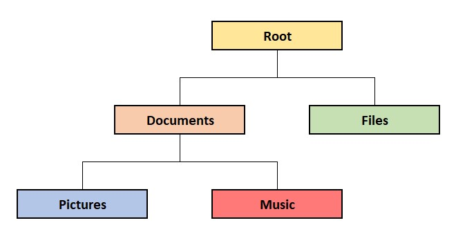
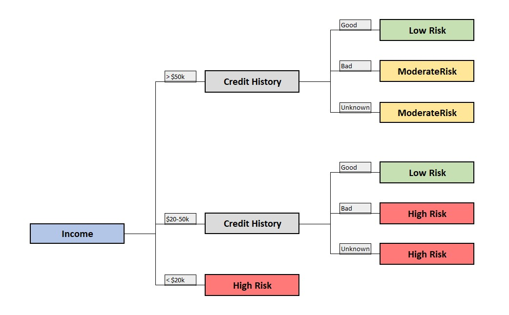

# Tree
A tree is a data structure that is composed of nodes connected in a hierarchical manner. It is commonly used to represent hierarchical relationships or organized data.

Here are some things that can be done because of set:
1. Traversing the Tree
2. Insertion and Deletion
3. Balancing
4. Sorting and Searching
5. Representing Hierarchical Structures

## Hierarchal Relationships
Hierarchical relationships are relationships that are organized in a tree-like structure.  For example, a file system is a hierarchical structure that organizes files and folders in a tree-like structure.  A decision tree is another example of a hierarchical structure that is used to make decisions based on a series of questions.

In the following, we will create a visual of a file system hierarchy and a decision tree.


```python
# Define a class for a binary tree node
class Node:
    def __init__(self, name):
        self.name = name
        self.left = None
        self.right = None

# Function to traverse the binary tree and print the file system hierarchy
def traverse_filesystem(node, level=0):
    if node:
        print(' ' * level + node.name)
        traverse_filesystem(node.left, level + 4)
        traverse_filesystem(node.right, level)

# Creating the file system hierarchy
root = Node('Root')
documents = Node('Documents')
pictures = Node('Pictures')
music = Node('Music')
files = Node('Files')
root.left = documents
documents.left = pictures
documents.right = music
root.right = files

# Performing a traversal of the file system hierarchy
traverse_filesystem(root)

```

## Example : Decision
A decision tree is a tree-like structure that is used to make decisions based on a series of questions.  It is commonly used in machine learning to classify data based on a series of questions.  For example, a decision tree can be used to classify a car as fuel-efficient or not based on a series of questions about the car.

```python
# Define a class for a binary tree node
class Node:
    def __init__(self, question):
        self.question = question
        self.left = None
        self.right = None

# Function to traverse the decision tree and make a decision based on user input
def make_decision(node):
    if node.left is None and node.right is None:
        return node.question
    answer = input(node.question + " (yes/no): ")
    if answer.lower() == 'yes':
        return make_decision(node.left)
    elif answer.lower() == 'no':
        return make_decision(node.right)

# Creating the decision tree
root = Node("Is the car fuel-efficient?")
root.left = Node("Does the car have a hybrid engine?")
root.right = Node("Does the car have a diesel engine?")
root.left.left = Node("Buy the hybrid car!")
root.left.right = Node("Buy the petrol car.")
root.right.left = Node("Buy the diesel car.")
root.right.right = Node("Buy the petrol car.")

# Making a decision using the decision tree
decision = make_decision(root)
print("Decision:", decision)
```



## Problem to Solve : Risk Assessment

Problem: Write a binary decision tree algorithm to assess the risk level of a loan applicant.

```python
dataset = [
    (40000, 0.2, 'low'),
    (60000, 0.8, 'low'),
    (80000, 0.6, 'moderate'),
    (20000, 0.1, 'high'),
    (30000, 0.3, 'moderate'),
    (90000, 0.7, 'high'),
    (70000, 0.5, 'low')
]

# New applicants to assess
new_applicant1 = (45000, 0.7)
new_applicant2 = (75000, 0.2)
new_applicant3 = (25000, 0.5)

# Mapping the prediction to risk labels
risk_mapping = {'low': 'Low Risk', 'moderate': 'Moderate Risk', 'high': 'High Risk'}

# Printing the predicted risk levels for the new applicants
print("Predicted Risk Level for Applicant 1:", predicted_risk_level1)
print("Predicted Risk Level for Applicant 2:", predicted_risk_level2)
print("Predicted Risk Level for Applicant 3:", predicted_risk_level3)
```



The expected output for this example would be:

To solve this problem, you can follow these steps:

1. Create a binary decision tree where each node represents a feature and its value for splitting the data.
2. Assign a risk label (low, moderate, high) to each leaf node based on the majority class in that node.
3. Given a new loan applicant's income and credit history, traverse the decision tree to determine the risk level for the applicant.
4. Print the predicted risk level for the new applicant.

You can check your code with the solution here: [Solution](3-tree.py)


[Back to Welcome Page](0-welcome.md)