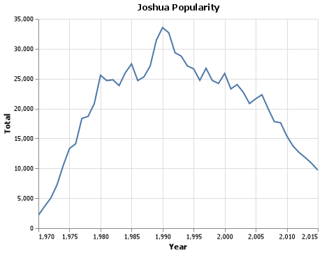
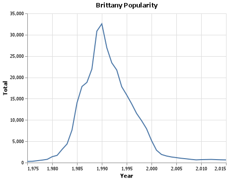
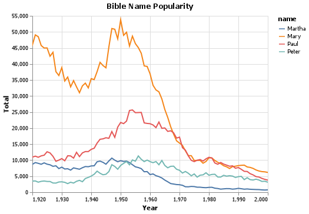
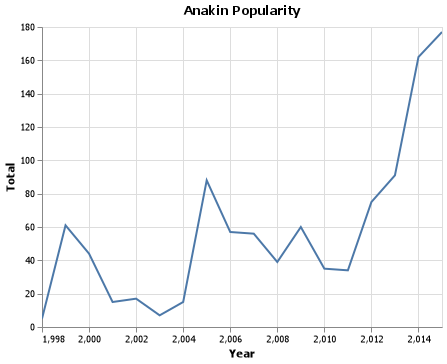

# Client Report - [Project 1: What is in a name? ]
__Course DS 250__
__Joshua Ludwig__

## Elevator pitch

_An analysis of commom and not so common names used over time in the United States. This is uncludes my personal name, Brittany, Biblical names, and the name Anakin from the Star Wars prequel movies. This gives data, graphs, and tables showing the popularity of these names over time and how they have declined and grown over time._

### GRAND QUESTION 1
#### How does your name at your birth year compare to its use historically?
_The name Joshua hit a peak around the year 1990 with around 33,000 babies born with thre name in the U.S.; however, when I was born in 2002, the name was in decline but still with a good amount of babies born with that name. The year I was born there was about 23,000 babies born with the name Joshua._

##### TECHNICAL DETAILS

```python 
#%% Joshua Names

joshuaChart = alt.Chart(Joshua, title="Joshua Popularity").mark_line(clip=True).encode(
    alt.X("year", title="Year",scale=alt.Scale(domain=(1950, 2015))),
    alt.Y("Total", title="Total")
).properties(width=400, height=300)

joshuaChart

# %% Save Joshua Chart

joshuaChart.save("joshua_chart.png")
```




```python 
table = Joshua.head(83)
print(table.to_markdown())
```
|        | name   |   year |   Total |
|-------:|:-------|-------:|--------:|
| 196610 | Joshua |   1910 |     5   |
| 196611 | Joshua |   1911 |    12   |
| 196612 | Joshua |   1912 |    17   |
| 196613 | Joshua |   1913 |    54   |
| 196614 | Joshua |   1914 |    55   |
| 196615 | Joshua |   1915 |    87   |
| 196616 | Joshua |   1916 |    54   |
| 196617 | Joshua |   1917 |    90   |
| 196618 | Joshua |   1918 |    89   |
| 196689 | Joshua |   1989 | 31443   |
| 196690 | Joshua |   1990 | 33545   |
| 196691 | Joshua |   1991 | 32659.5 |
| 196692 | Joshua |   1992 | 29337.5 |

### GRAND QUESTION 2
#### If you talked to someone named Brittany on the phone, what is your guess of their age? What ages would you not guess?
_From the chart, I would guess that someone named Brittany would have been born in around the 1990s therefore their age would be about 30. I would not guess there age is more than 37 or less than 22._

##### TECHNICAL DETAILS

```python 
brittanyChart = alt.Chart(Brittany, title="Brittany Popularity").mark_line(clip=True).encode(
    alt.X("year", title="Year",scale=alt.Scale(domain=(1975, 2015))),
    alt.Y("Total", title="Total")
).properties(width=400, height=300)
```



```python 
#%% Brittany Table code
table = Brittany.head(31)
print(table.to_markdown())
```
|       | name     |   year |   Total |
|------:|:---------|-------:|--------:|
| 53222 | Brittany |   1985 | 14010   |
| 53223 | Brittany |   1986 | 17856.5 |
| 53224 | Brittany |   1987 | 18825.5 |
| 53225 | Brittany |   1988 | 21952   |
| 53226 | Brittany |   1989 | 30848   |
| 53227 | Brittany |   1990 | 32562.5 |
| 53228 | Brittany |   1991 | 26963.5 |
| 53229 | Brittany |   1992 | 23416.5 |
| 53230 | Brittany |   1993 | 21728   |
| 53231 | Brittany |   1994 | 17808.5 |
| 53232 | Brittany |   1995 | 15875.5 |
| 53233 | Brittany |   1996 | 13796   |
| 53234 | Brittany |   1997 | 11527   |
| 53235 | Brittany |   1998 |  9843   |

### GRAND QUESTION 3
#### Mary, Martha, Peter, and Paul are all Christian names. From 1920 - 2000, compare the name usage of each of the four names.
_These Bible names were most popular from around the 1920s to the 1920s where there was a massive drg in these Bible names. The name Mary was most popular out of the four with the names hitting a peak in the 1950s. Martha and Paul were easily the least popular names out of the four._

##### TECHNICAL DETAILS

```python 
#%% Bible Names
bibleChart = alt.Chart(Bible, title="Bible Name Popularity").mark_line(clip=True).encode(
    alt.X("year", title="Year",scale=alt.Scale(domain=(1920, 2000))),
    alt.Y("Total", title="Total"),
    color = 'name')
```



```python 
#%% Bible Table code
table = Bible.head(42)
print(table.to_markdown())
```
|        | name   |   year |   Total |
|-------:|:-------|-------:|--------:|
| 264145 | Martha |   1941 |  8250.5 |
| 264146 | Martha |   1942 |  9514   |
| 264147 | Martha |   1943 |  9700   |
| 264148 | Martha |   1944 |  9329   |
| 303636 | Peter  |   1941 |  5608   |
| 303637 | Peter  |   1942 |  6582   |
| 303638 | Peter  |   1943 |  5920   |
| 303639 | Peter  |   1944 |  5450   |
| 264917 | Mary   |   1948 | 50828   |
| 264918 | Mary   |   1949 | 47835   |
| 264919 | Mary   |   1950 | 53791   |
| 264920 | Mary   |   1951 | 48928.5 |
| 301491 | Paul   |   1952 | 22197.5 |
| 301492 | Paul   |   1953 | 25497   |
| 301493 | Paul   |   1954 | 25662.5 |
| 301494 | Paul   |   1955 | 24818.5 |

### GRAND QUESTION 4
#### Think of a unique name from a famous movie. Plot that name and see how increases line up with the movie release.
_The name Anakin from the Star Wars prequel movies was the name of the main character --Anakin Skywalker. This was not a name before Star Wars: The Phantom Menace therefore it did not exist until 1998 --one year before the release of the movie. The name hit a local peak in 2005 when the last prequel Star Wars movie released. Afterwards the name declined in use, until around 2011 when it started gaining popularity when it hit its peak in 2015._

##### TECHNICAL DETAILS

```python 
#%% Anakin Names

anakinChart = alt.Chart(Anakin, title="Anakin Popularity").mark_line(clip=True).encode(
    alt.X("year", title="Year",scale=alt.Scale(domain=(1998, 2015))),
    alt.Y("Total", title="Total")
).properties(width=400, height=300)

anakinChart
```



```python 
#%% Anakin Table code
table = Anakin.head(42)
print(table.to_markdown())
```
|       | name   |   year |   Total |
|------:|:-------|-------:|--------:|
| 19325 | Anakin |   1998 |       5 |
| 19326 | Anakin |   1999 |      61 |
| 19327 | Anakin |   2000 |      44 |
| 19328 | Anakin |   2001 |      15 |
| 19329 | Anakin |   2002 |      17 |
| 19330 | Anakin |   2003 |       7 |
| 19331 | Anakin |   2004 |      15 |
| 19332 | Anakin |   2005 |      88 |
| 19333 | Anakin |   2006 |      57 |
| 19334 | Anakin |   2007 |      56 |
| 19335 | Anakin |   2008 |      39 |
| 19336 | Anakin |   2009 |      60 |
| 19337 | Anakin |   2010 |      35 |
| 19338 | Anakin |   2011 |      34 |
| 19339 | Anakin |   2012 |      75 |
| 19340 | Anakin |   2013 |      91 |
| 19341 | Anakin |   2014 |     162 |
| 19342 | Anakin |   2015 |     177 |

## APPENDIX A (PYTHON CODE)
```python
#%%
import pandas as pd
import altair as alt
import numpy as np


#%%
names = pd.read_csv("names_year.csv")


# GRAND QUESTION 1
# %% Joshua query
Joshua = names.query("name == 'Joshua'")[["name", "year", 'Total']]
print(Joshua)

#%% Joshua Names

joshuaChart = alt.Chart(Joshua, title="Joshua Popularity").mark_line(clip=True).encode(
    alt.X("year", title="Year",scale=alt.Scale(domain=(1970, 2015))),
    alt.Y("Total", title="Total")
).properties(width=400, height=300)

joshuaChart

# %% Save Joshua Chart

joshuaChart.save("joshua_chart.png")

#%% Joshua Table code
table = Joshua.head(83)
print(table.to_markdown())


# GRAND QUESTION 2
# %% Create Brittany query

Brittany = names.query("name == 'Brittany'")[["name", "year", 'Total']]
print(Brittany)

#%% Brittany Names

brittanyChart = alt.Chart(Brittany, title="Brittany Popularity").mark_line(clip=True).encode(
    alt.X("year", title="Year",scale=alt.Scale(domain=(1975, 2015))),
    alt.Y("Total", title="Total")
).properties(width=400, height=300)

brittanyChart
# %% Save Brittany Chart

brittanyChart.save("brittany_chart.png")

#%% Brittany Table code
table = Brittany.head(31)
print(table.to_markdown())


# GRAND QUESTION 3
# %% Create Mary, Martha, Peter, and Paul From 1920 - 2000
# allBilble = ["Mary", "Martha", "Peter", "Paul"]
Bible =  names.query('name in ["Mary", "Martha", "Peter", "Paul"]')[["name", "year", 'Total']]
print(Bible)
#%% Bible Names

bibleChart = alt.Chart(Bible, title="Bible Name Popularity").mark_line(clip=True).encode(
    alt.X("year", title="Year",scale=alt.Scale(domain=(1920, 2000))),
    alt.Y("Total", title="Total"),
    color = 'name')
    
    # .transform_filter(
    # alt.FieldOneOfPredicate(field='name', oneOf=['Mary', 'Martha', 'Peter'])


bibleChart
#%% Save bible Chart

bibleChart.save("bible_chart.png")

#%% Bible Table code
table = Bible.head(42)
print(table.to_markdown())


# GRAND QUESTION 4
# %%# Anakin query
Anakin = names.query("name == 'Anakin'")[["name", "year", 'Total']]
print(Anakin)

#%% Anakin Names

anakinChart = alt.Chart(Anakin, title="Anakin Popularity").mark_line(clip=True).encode(
    alt.X("year", title="Year",scale=alt.Scale(domain=(1998, 2015))),
    alt.Y("Total", title="Total")
).properties(width=400, height=300)

anakinChart
# %% Save Harry Chart

anakinChart.save("anakin_chart.png")

#%% Anakin Table code
table = Anakin.head(42)
print(table.to_markdown())


# %% Create Mary, Martha, Peter, and Paul From 1920 - 2000
# allBilble = ["Mary", 'Martha', 'Peter', 'Paul']
State1 = "TX"
State2 = "MD"
State3 = "IL"
grand = State1 + State2 + State3
friends =  names.query('name in ["Luke", "Joshua", "Nathalie"]')[["name", "year",State1, State2, State3, 'Total']]
print(friends)
#%% Bible Names

friendChart = alt.Chart(friends, title="Bible Name Popularity").mark_line(clip=True).encode(
    alt.X("year", title="Year",scale=alt.Scale(domain=(1970, 2015))),
    alt.Y("Total", title="Total"),
    color = 'name')
    
    # .transform_filter(
    # alt.FieldOneOfPredicate(field='name', oneOf=['Mary', 'Martha', 'Peter'])


friendChart

# %%


```
